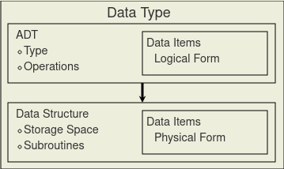

# Definition

> In computer science and computer programming, a data type (or simply type) is a set of possible values and a set of allowed operations on it. A data type tells the compiler or interpreter how the programmer intends to use the data. Most programming languages support basic data types of integer numbers (of varying sizes), floating-point numbers (which approximate real numbers), characters and Booleans. A data type constrains the possible values that an expression, such as a variable or a function, might take. This data type defines the operations that can be done on the data, the meaning of the data, and the way values of that type can be stored.

- [Wikipedia]

# Composition of a Data Type

> Data structures serve as the basis for abstract data types (ADT). The ADT defines the logical form of the data type. The data structure implements the physical form of the data type.

- [Wikipedia]

See [Abstract_Data_Type](Abstract_Data_Type.md) and [Data_Structure](Data_Structure.md).

- From [OpenDSA]

# Types of Data Types

- [Primitive_Data_Type](Primitive_Data_Type.md)

[Wikipedia]: https://en.wikipedia.org/wiki/Data_type

[OpenDSA]: https://opendsa-server.cs.vt.edu/ODSA/Books/CS3/html/ADT.html
