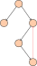
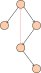

# Problem

From [LeetCode](https://leetcode.com/problems/redundant-connection-ii/description/):

> In this problem, a rooted tree is a **directed** graph such that, there is exactly one node (the root) for which all other nodes are descendants of this node, plus every node has exactly one parent, except for the root node which has no parents.
>
> The given input is a directed graph that started as a rooted tree with `n` nodes (with distinct values from `1` to `n`), with one additional directed edge added. The added edge has two different vertices chosen from `1` to `n`, and was not an edge that already existed.
>
> The resulting graph is given as a 2D-array of `edges`. Each element of `edges` is a pair `[ui, vi]` that represents a **directed** edge connecting nodes `ui` and `vi`, where `ui` is a parent of child `vi`.
>
> Return _an edge that can be removed so that the resulting graph is a rooted tree of_ `n` _nodes_. If there are multiple answers, return the answer that occurs last in the given 2D-array.

# Algorithm

## Cases to be considered

Given a binary tree with a random edge added between two already existing nodes, there are 3 different scenarios which must be considered.

1. The new edge causes a node to have 2 parents and a cycle **is not** introduced.


2. The new edge causes a node to have 2 parents and a cycle **is** introduced.



3. The new edge has a destination of the root node, meaning all nodes have 1 parent, and a cycle is introduced.



## High Level Description

The algorithm steps can be roughly written as,

1. Check if any vertex has two parents.
2. If one does, remove the edge which appears latest in `edges` that points into that vertex.
3. Check for a loop in the graph formed by the newly modified `edges`.
4. If a loop does exist
   1. if there was no vertex with two parents in step 1, return the edge which appears latest in `edges` that is part of the loop
   2. or, return the other edge that was not removed in step 2.
5. No loop exists, so return the other edge that was removed in step 2.

## Implementation

Below is an implementation in `C++`:

```cpp
vector<int> findRedundantDirectedConnection(vector<vector<int>>& edges) {
	int n = edges.size();
	vector<int> parent(n+1, 0);
	vector<int> maybe_edge1 = {0,0};
	vector<int> maybe_edge2 = {0,0};

	// step 1, check whether there is a node with two parents
	for (auto &edge:edges) {
		if (parent[edge[1]] == 0)
			parent[edge[1]] = edge[0]; 
		else {
			maybe_edge1 = {parent[edge[1]], edge[1]};
			maybe_edge2 = edge;
			edge[1] = 0;
		}
	} 

	// step 2, detect loops
	for (int i = 1; i <= n; i++) parent[i] = i;
	for (auto &edge:edges) {
		if (edge[1] == 0) continue;
		int u = edge[0];
		int v = edge[1];
		int u_par = root(parent, u);

		if (u_par == v) {
			if (maybe_edge1[0] == 0) return edge;
			return maybe_edge1;
		}
		
		parent[v] = u_par;
	}
	return maybe_edge2;
}

int root(vector<int>& parent, int k) {
	if (parent[k] != k) 
		parent[k] = root(parent, parent[k]);
	return parent[k];
}
```
